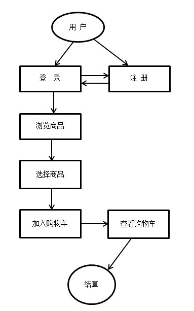

---
layout: post
title: "node+mongodb电商项目实战"
date: 2018-04-13
description: "node+mongodb实现电商基本功能：登录注册、商品浏览及购物车"
tag: Node
---   

# 小电商项目实战

参考：<http://www.hubwiz.com/course/549a704f88dba0136c371703/>

## 设计

### 需求设计
1、功能：

1. 注册、登录
2. 登陆后，浏览商品，选购商品并加入购物车
3. 购物车：增加、减少、删除；购物车结算

2、技术选型

项目涉及：Nodejs、Express框架、MongoDB数据库、Mongoose对象模型库

- `Nodejs`：采用Google Chrome浏览器的V8引擎，一个后端的Javascript运行环境，提供很多系统级的API，如文件操作、[网络编程](https://www.cnblogs.com/myd620/p/6111442.html)等。
- `Express`：基于Node.js的Web应用开发框架, 支持Ejs、jade等多种模板，并且提供一系列强大的功能，比如：模板解析、静态文件服务、中间件、路由控制等等。
- `MongoDB`：MongoDB是一个基于分布式文件存储的一个高性能，开源，无模式的文档型数据库，数据以BSON文档的格式存储在磁盘上。
- `Mongoose`：是在node.js异步环境下对mongodb进行便捷操作的对象模型库，封装了MongoDB对文档的的一些增删改查等常用方法。

3、结构划分

1. 用户注册模块：填写用户名、密码、确认密码；成功注册，自动登录；
2. 用户登录模块：填写用户名、密码，正确后，登录成功，进行商品展示；
3. 商品模块：用户选择相关产品加入购物车；
4. 购物车模块：对购物车产品进行修改、添加、删除操作；
5. 结算模块：对购物车内已选择商品进行结算。

4、流程设计

### 数据库设计

创建三个集合：user(用户)集合、commodity(商品)集合、cart(购物车)集合：

- user中字段：name、passord
- commodity中字段：name、price、imgSrc
- cart：uId(用户ID)、cId(商品ID)、cName(商品名称)、cPrice(商品价格)、cImgSrc(商品展示图片路径)、cQuantity(商品数量)、cStatus(商品结算状态，未结算为false,已结算为true)

## 功能实现

快速创建express项目的方法：[创建第一个Node.js Express App](/2018/04/WebStorm创建第一个Node.js-Express-App)

### 项目目录

1. public目录：存放静态文件（js、css、img）。
2. routes目录：存放路由文件。
3. views目录： 存放页面文件（html）。
4. common目录：存放公共文件。

### 公共方法

1）`common/models.js`--> 用来保存各个`集合`的Schema（以文件形式存储的数据库模型骨架-->`表结构`），便于利用Schema创建-->Model，在数据库中创建真正的集合。
	
	module.exports = {
	    user: {
	        name: { type: String, required: true },
	        password: { type: String, required: true }
	    },
	    commodity: {
	        name: String,
	        price: Number,
	        imgSrc: String
	    },
	    cart:{
	        uId: { type: String },
	        cId: { type: String },
	        cName: { type: String },
	        cPrice: { type: String },
	        cImgSrc: { type:String } ,
	        cQuantity: { type: Number },
	        cStatus : { type: Boolean, default: false  }
	    }
	};

2）`common/dbHelper.js`--> 通过加载`models.js`（集合结构），由Schema构造生成集合的Model模型（可以对数据库有实质性的操作）

	var mongoose=require('mongoose'),//加载mongodb对象操作模型库
	    Schema=mongoose.Schema,
	    models=require('./models');
	
	for(var m in models){
	    mongoose.model(m,new Schema(models[m]));//通过骨架，构造model
	}
	module.exports = {
	    getModel: function (type) {
	        return mongoose.model(type);
	    }
	};

### 注册

1）`app.js`：
	
	//1、模块加载
	var express=require("express"),
	    session=require("express-session"),
	    mongoose=require("mongoose"),
	    bodyParser = require('body-parser'),
	    multer = require('multer'),
	    ejs=require('ejs'),
	    path=require('path');
	    //定义全局变量dbHelper；在dbHelper中：mongoose操作Schema获取Model的方法
	    global.dbHelper = require( './common/dbHelper' );
	
	//2、创建web实例-->app
	    var app=express();
	
	
	//3、设定view engine变量，意为网页模板引擎；使用ejs模板引擎，处理后缀名为html文件
	app.set('view engine','html');
	app.engine('.html',ejs.__express);
	
	//4、设定views变量，意为视图存放的目录
	app.set('views',path.join(__dirname,'views'));
	
	//5、指定静态资源访问路径
	app.set(express.static(path.join(__dirname,'public')));
	
	//6、挂载中间件
	app.use(session({
	    secret:'secret',
	    cookie:{
	        maxAge:1000*60*30
	    },
	    resave:true,//重新保存：强制保存session即使它并没有变化。默认为true但是得写上
	    saveUninitialized:true//强制将未初始化的session存储。
	}));
	app.use(bodyParser.json());//解析application/json
	app.use(bodyParser.urlencoded({ extended: false}));//解析application/x-www-form-urlencoded
	app.use(multer());
	
	
	//7、mongoose-->接mongodb数据库
	global.db = mongoose.connect("mongodb://127.0.0.1:27017/test");
	mongoose.connection.on('disconnected', function (error) {
	    console.log("数据库连接失败：" + error);
	});
	mongoose.connection.on('connected', function () {
	    console.log("succeed:数据库连接成功!");
	});
	
	//8、挂载路由中间件，在服务器给出响应之前，用于对HTTP请求不断加工
	app.use(function(req,res,next){
	    res.locals.user = req.session.user;//保存用户信息
	    var err = req.session.error;//保存响应结果信息
	    res.locals.message = '';//保存html标签
	    if (err) res.locals.message = '
' + err + '
';
	    next();
	})
	
	//9、挂载路由到指定路径
	require('./routes/register.js')(app);
	
	//10、指定监听端口：要么通过环境变量指定，环境变量没有指定则默认80端口
	var port=process.env.PORT||80;
	app.listen(port);
	console.log('Magic happens on port ' + port);

2）路由：`routes/register.js`：

	module.exports=function(route){
	    route.get('/register',function(req,res){
	        res.render('register');
	    });
	
	    route.post('/register',function(req,res){
			//通过全局变量dbHelper，使用自定义的getModel：得到集合-->user
	        var User=global.dbHelper.getModel('user');

			//通过req.body，取得http-->post请求发送来的参数(依赖模块：body-parser)
	        var name=req.body.name;

			//查找数据库中是否已经存在用户名，否：则利用user.create()向集合user中插入document
	        User.findOne({name:name},function(err,doc){
	            if (err) {
	                res.sendStatus(500);
	                req.session.error = '网络异常错误！';
	                console.log("error:"+err);
	            }
	            else if(doc){
	                req.session.error="用户名已经存在";
	                res.sendStatus(500);
	            }
	            else{
	                User.create({name:name,password:req.body.password},function(err,doc){
	                    if(err){
	                        console.log("error:"+err);
	                        res.sendStatus(500);
	                    }
	                    else{
	                        req.session.error = '用户名创建成功！';
	                        res.sendStatus(200);
	                    }
	                })
	            }
	        })
	    });
	    return route;
	}

3）视图：`views/register.html`：

body部分：（简单实现功能，没加样式）

	<body>
	

	    <%- message %>
	    
<h1>用户注册</h1>

	    

	        <form action="#">
	            <label for="username">姓名：</label>
	            <input type="text" id="username" name="username" placeholder="用户名"/>
	             
	            <label for="password">密码：</label>
	            <input type="password" id="password" name="password" placeholder="密码"/>
	             
	            <label for="confirmpwd">确认密码：</label>
	            <input type="password" id="confirmpwd" name="confirmpwd" placeholder="确认密码"/>
	             
	            <input type="button" value="注册" onclick="register()"/>
	        </form>
	    

	

	</body>

JavaScript部分：

	

### 登录

1）路由：`routes/login.js`：

	module.exports=function(route){
	    route.get('/login',function(req,res){
	        if(req.session.user){
	            res.redirect('/home');//如果用户已经登录成功，转跳“/home”路由
	        }
	        else{
	            res.render('login');
	        }
	    });
	
	    route.post('/login',function(req,res){
	        var User = global.dbHelper.getModel('user');
	        var name=req.body.name;
	
			//查找数据库中是否存在用户请求登录的用户名
	        User.findOne({name:name},function(err,doc){
	            if(err){
	                req.session.error = '网络异常错误！';
	                console.log(error);
	                res.sendStatus(500);
	            }
	            else if(doc){
	                if(doc.password==req.body.password){
	                    req.session.error='登录成功！';
	                    req.session.user=doc;
	                    res.sendStatus(200);
	                }
	                else{
	                    req.session.error='用户存在，密码不正确！';
	                    res.sendStatus(404);
	                }
	            }
	            else{
	                req.session.error='用户名不存在！';
	                res.sendStatus(404);
	            }
	        })
	
	    });
	    return route;
	}

2）视图：`viewa/login.js`:

body部分：

	<body>
	

	    <%- message %>
	    
<h1>用户登录</h1>

	    

	        <form action="#">
	            <label for="username">姓名：</label>
	            <input type="text" id="username" name="username" placeholder="用户名"/>
	             
	            <label for="password">密码：</label>
	            <input type="password" id="password" name="password" placeholder="密码"/>
	             
	
	            <input type="button" value="登录" onclick="login()"/>
	            <a href="register">注册</a>
	        </form>
	    

	

	</body>

javascript部分：

	

### 商品展示

1）路由：home.js

2）视图：home.html

### 商品管理

包括商品的增删改查，四大部分。

1）路由：addcommodity.js

2）视图：addcommodity.html

### 购物车结算

## 遇到的问题及解决方法：

### 1、文件上传（Multer）

[跳转]()

### 2、静态资源访问受限
浏览器出现错误提示：

	Refused to apply style from 'http://localhost/stylesheets/bootstrap.min.css' because its MIME type ('text/html') is not a supported stylesheet MIME type, and strict MIME checking is enabled.
	GET http://localhost/images/xmsz-1.jpg 404 (Not Found)

解决方法：将指定静态资源访问路径的一条语句

	app.set(express.static(path.join(__dirname,'public')));

改为：

	app.use(express.static(path.join(__dirname,'public')));

### 3、文本节点（空白节点）

	<ul id="ul">
	    <li></li>
	    <li></li>
	</ul>
	

如上代码，有的浏览器输出`2`，而有的浏览器输出为`5`,这是因为存在`文本节点`。

文本节点：换行，制表符这些特殊的文本字符组成，有的浏览器会忽略这些节点，有的浏览器则认可。

通常情况下我们都不需要空白节点影响获取节点，因此去除空白节点的方法：

	function removeWhiteNode(node) {
	    for (var i = 0; i < node.childNodes.length; i++) {
	        if (node.childNodes[i].nodeType === 3 && /^\s+$/.test(node.childNodes[i].nodeValue)) {
	            node.childNodes[i].parentNode.removeChild(node.childNodes[i]);
	        }
	    }
	    return node;
	}

### 4、点击表单提交按钮页面自动刷新（或者转跳）问题

场景：通过Ajax，用post方法提交表单的时候，点击`确认提交`，提交成功后，页面总是自动刷新了

方法一：iframe

	<iframe name="formsubmit" style="display:none;"></iframe>
	
	<form action="#" target="formsubmit">
	…………
	</form>

方法二：阻止表单自动提交

	event.preventDefault() //阻止form表单默认提交      

方法三：`<button>`标签的type属性不为`submit`，改为：

	<button type="button">提交</button>
  
 
### 5、``自动缩放，并且不改变原本比例

	

		
	

通过给``标签包裹设置了宽高的div，然后限制img的最大宽高，将img图片限制。

### 6、用js控制：bootstrap-modal模态框

一般情况下：

	<!-- 按钮触发模态框 -->
	<button type="button" data-toggle="modal" data-target="#modal">打开模态框</button>
	
	<!-- 模态框（Modal） -->
	

		//code
	

用按钮触发模态框显示，关键是：

- `data-toggle="modal"`：用于打开模态框窗口
- `data-target="#modal"`：打开的目标

如何用js控制模态框的打开，而不是点击按钮呢？

- 取消按钮的 `data-toggle="modal"`和`data-target="#modal"`两个属性的设置；
- 在js中通过以下代码控制模态框的显示和隐藏： 
`$('#modal').modal('hide')` 
`$('#modal').modal('show')`

### 7、js控制：bootstrap-dropdown下拉菜单

一般情况：

	

	  <button type="button" class="btn btn-primary dropdown-toggle" data-toggle="dropdown">Dropdown button</button>

	  

	    <a class="dropdown-item" href="#">Link 1</a>
	    <a class="dropdown-item" href="#">Link 2</a>
	    <a class="dropdown-item" href="#">Link 3</a>
	  

	

- `class="dropdown"`：包裹触发节点和下拉菜单，使它们位置上关联；
- `class="dropdown-toggle"`：用于指定下拉菜单的触发节点；
- `data-toggle="dropdown"`：用于点击触发下拉菜单显示，绑定这个动作；
- `class="dropdown-menu"`：指定下拉菜单。

js控制下拉菜单的显示：

- 取消按钮的`data-toggle="dropdown"`属性设置；

	$('.dropdown-menu').dropdown("toggle");

其中`$('.dropdown-menu')`是触发节点。

**问题**：js控制下拉菜单后，怎么使其隐藏？网上有很多人说再次调用`$('.dropdown-menu').dropdown("toggle");`，我试了试，不行。 
**解决**：用jQuery中的`slideDown()`和`slideUp()`解决这个问题：

	$('.dropdown-menu').slideDown();//显示下拉菜单
	$(".dropdown-menu").slideUp();//隐藏下拉菜单
